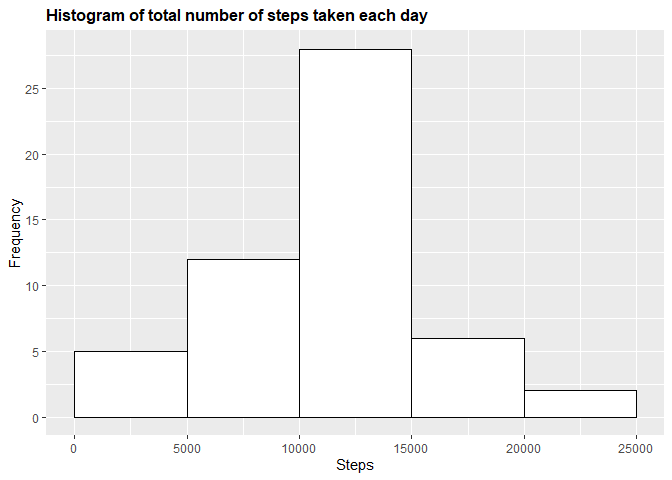
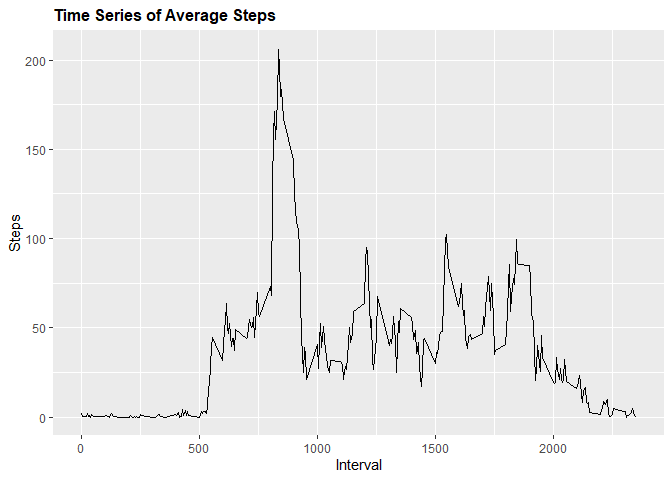
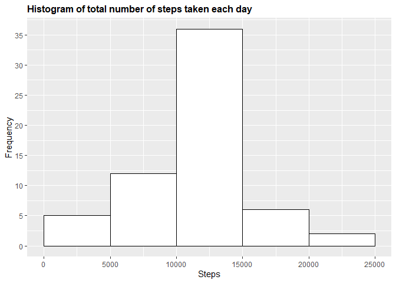
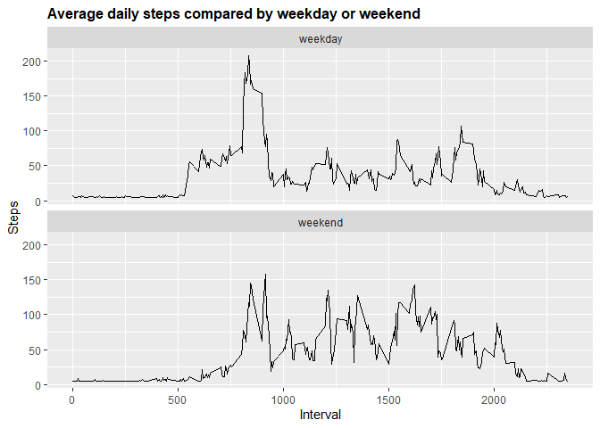

Reproducible Research Course Project 1
================
Colyn Goh
8/29/2020

#### 1\. Loading and preprocessing data

``` r
if(!file.exists('activity.csv')){
    unzip('activity.zip')
}
activity <- read.csv('activity.csv')
library(ggplot2)
```

    ## Warning: package 'ggplot2' was built under R version 4.0.2

``` r
library(dplyr)
```

    ## 
    ## Attaching package: 'dplyr'

    ## The following objects are masked from 'package:stats':
    ## 
    ##     filter, lag

    ## The following objects are masked from 'package:base':
    ## 
    ##     intersect, setdiff, setequal, union

#### 2\. What is the mean total number of steps taken per day?

``` r
# Calculate the total number of steps taken per day
dailysteps <- aggregate(activity$steps, list(activity$date), FUN = sum)
colnames(dailysteps) <- c("Date", "Steps")
dailysteps
```

    ##          Date Steps
    ## 1  2012-10-01    NA
    ## 2  2012-10-02   126
    ## 3  2012-10-03 11352
    ## 4  2012-10-04 12116
    ## 5  2012-10-05 13294
    ## 6  2012-10-06 15420
    ## 7  2012-10-07 11015
    ## 8  2012-10-08    NA
    ## 9  2012-10-09 12811
    ## 10 2012-10-10  9900
    ## 11 2012-10-11 10304
    ## 12 2012-10-12 17382
    ## 13 2012-10-13 12426
    ## 14 2012-10-14 15098
    ## 15 2012-10-15 10139
    ## 16 2012-10-16 15084
    ## 17 2012-10-17 13452
    ## 18 2012-10-18 10056
    ## 19 2012-10-19 11829
    ## 20 2012-10-20 10395
    ## 21 2012-10-21  8821
    ## 22 2012-10-22 13460
    ## 23 2012-10-23  8918
    ## 24 2012-10-24  8355
    ## 25 2012-10-25  2492
    ## 26 2012-10-26  6778
    ## 27 2012-10-27 10119
    ## 28 2012-10-28 11458
    ## 29 2012-10-29  5018
    ## 30 2012-10-30  9819
    ## 31 2012-10-31 15414
    ## 32 2012-11-01    NA
    ## 33 2012-11-02 10600
    ## 34 2012-11-03 10571
    ## 35 2012-11-04    NA
    ## 36 2012-11-05 10439
    ## 37 2012-11-06  8334
    ## 38 2012-11-07 12883
    ## 39 2012-11-08  3219
    ## 40 2012-11-09    NA
    ## 41 2012-11-10    NA
    ## 42 2012-11-11 12608
    ## 43 2012-11-12 10765
    ## 44 2012-11-13  7336
    ## 45 2012-11-14    NA
    ## 46 2012-11-15    41
    ## 47 2012-11-16  5441
    ## 48 2012-11-17 14339
    ## 49 2012-11-18 15110
    ## 50 2012-11-19  8841
    ## 51 2012-11-20  4472
    ## 52 2012-11-21 12787
    ## 53 2012-11-22 20427
    ## 54 2012-11-23 21194
    ## 55 2012-11-24 14478
    ## 56 2012-11-25 11834
    ## 57 2012-11-26 11162
    ## 58 2012-11-27 13646
    ## 59 2012-11-28 10183
    ## 60 2012-11-29  7047
    ## 61 2012-11-30    NA

``` r
# Make a histogram of the total number of steps taken each day
g1 <- ggplot(dailysteps, aes(Steps))
g1 + geom_histogram(boundary = 0, binwidth = 5000, col = "black", fill = "white") + 
     ggtitle("Histogram of total number of steps taken each day") + 
     xlab("Steps") + 
     ylab("Frequency") + 
     theme(plot.title = element_text(face = "bold", size = 12)) + 
     scale_x_continuous(breaks = seq(0, 25000, 5000)) + 
     scale_y_continuous(breaks = seq(0, 50, 5))
```

    ## Warning: Removed 8 rows containing non-finite values (stat_bin).

<!-- -->

``` r
# Calculate and report the mean and median of the total number of steps taken per day
mean(dailysteps$Steps, na.rm = TRUE)
```

    ## [1] 10766.19

``` r
median(dailysteps$Steps, na.rm = TRUE)
```

    ## [1] 10765

#### 3\. What is the average daily activity pattern?

``` r
# Make a time series plot of the 5-minute interval (x-axis) and the average number of steps taken, averaged across all days (y-axis)
stepsbytime <- aggregate(steps~interval, data = activity, FUN = mean, na.action = na.omit)
stepsbytime$time <- stepsbytime$interval
g2 <- ggplot(stepsbytime, aes(time, steps))
g2 + geom_line(col = "black") + 
     ggtitle("Time Series of Average Steps") + 
     xlab("Interval") + 
     ylab("Steps") + 
     theme(plot.title = element_text(face = "bold", size = 12))
```

<!-- -->

``` r
# Which 5-minute interval, on average across all the days in the dataset, contains the maximum number of steps?
maxsteps <- tibble::as_tibble(stepsbytime)
maxsteps %>% select(time, steps) %>% filter(steps == max(maxsteps$steps))
```

    ## # A tibble: 1 x 2
    ##    time steps
    ##   <int> <dbl>
    ## 1   835  206.

#### 4\. Imputing missing values

``` r
# Calculate and report the total number of missing values in the dataset 
sum(is.na(activity$steps))
```

    ## [1] 2304

``` r
# Fill in missing values in the dataset
activity$imputesteps <- ifelse(is.na(activity$steps), mean(stepsbytime$steps[match(activity$interval, stepsbytime$interval)], 0), activity$steps)
# Create a new dataset that is equal to the original dataset but with the missing data filled in
datasetfull <- data.frame(steps = activity$imputesteps, interval = activity$interval, date = activity$date)
imputesteps <- aggregate(datasetfull$steps, list(datasetfull$date), FUN = sum)
colnames(imputesteps) <- c("date", "completesteps")
# Histogram
g3 <- ggplot(imputesteps, aes(completesteps))
g3 + geom_histogram(boundary = 0, binwidth = 5000, col = "black", fill = "white") + 
     ggtitle("Histogram of total number of steps taken each day") + 
     xlab("Steps") + 
     ylab("Frequency") + 
     theme(plot.title = element_text(face = "bold", size = 12)) + 
     scale_x_continuous(breaks = seq(0, 25000, 5000)) + 
     scale_y_continuous(breaks = seq(0, 50, 5))
```

<!-- -->

``` r
# Mean and median
mean(imputesteps$completesteps)
```

    ## [1] 10766.19

``` r
median(imputesteps$completesteps)
```

    ## [1] 10766.19

#### 5\. Are there differences in activity patterns between weekdays and weekends?

``` r
# Create a new factor variable in the dataset with two levels – “weekday” and “weekend” 
datasetfull$correctdate <- as.Date(datasetfull$date, format = "%Y-%m-%d")
datasetfull$weekday <- weekdays(datasetfull$correctdate)
datasetfull$daytype <- ifelse(datasetfull$weekday == "Saturday" | datasetfull$weekday == "Sunday", "weekend", "weekday")
# Make a panel plot containing a time series plot of the 5-minute interval (x-axis) and the average number of steps taken, averaged across all weekday days or weekend days (y-axis)
stepsdaytype <- aggregate(steps~interval + daytype, data = datasetfull, FUN = mean, na.action = na.omit)
stepsdaytype$time <- stepsdaytype$interval
g4 <- ggplot(stepsdaytype, aes(time, steps))
g4 + geom_line() + 
     ggtitle("Average daily steps compared by weekday or weekend") + 
     xlab("Interval") + 
     ylab("Steps") + 
     theme(plot.title = element_text(face = "bold", size = 12)) + 
     facet_wrap(~daytype, ncol = 1, nrow = 2)
```

<!-- -->
